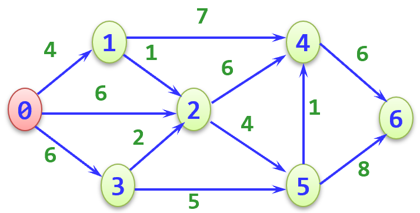

# 实验五 #

于2023.12.14完成

练习1：采用邻接矩阵表示法创建无向网

练习2：采用邻接表表示法创建无向网

练习3：采用邻接矩阵表示图的深度优先遍历

练习4：采用邻接表表示图的深度优先遍历

练习5_1：邻接矩阵实现图的广度优先遍历

练习5_2：邻接表实现图的广度优先遍历

实验五：Dijkstra算法求最短路径

要求：

    1、分别实现基于邻接矩阵和邻接表的Dijkstra算法

    2、基于下图，分别用邻接矩阵和邻接表这两种方式构建有向图

    3、主程序中输入起始顶点s和终点d，调用Dijkstra算法，打印出有向图中从顶点s到终点d的最短路径序列
